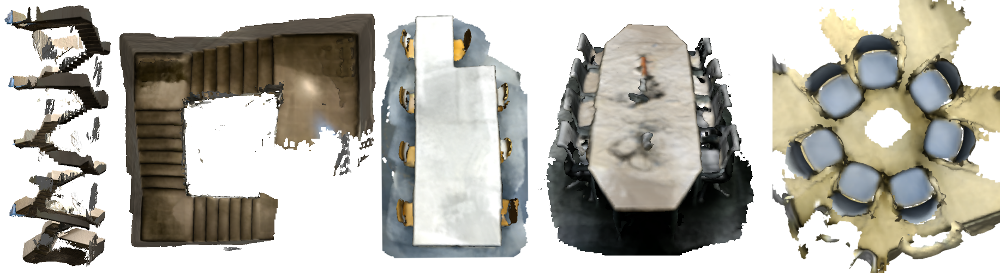

# Deep Bingham Networks

## License
MIT for non-commercial use otherwise see license terms. Copyright (C) 2020 Siemens AG

This repository contains the PyTorch implementation for the publications ['6D Camera Relocalization in Ambiguous Scenes via Continuous Multimodal Inference'](https://arxiv.org/abs/2004.04807 "Link to the paper") and 'Deep Bingham Networks: Dealing with Uncertainty and Ambiguity in Pose Estimation'.

## Dependencies
The code is implemented in Python 3 (https://docs.python.org/3/license.html)

- PyTorch (BSD License: https://github.com/pytorch/pytorch/blob/master/LICENSE)

- Torchvision (BSD License: https://github.com/pytorch/vision/blob/master/LICENSE)

- Bingham Statistics Library (BSD License: https://github.com/SebastianRiedel/bingham/blob/master/LICENSE) 

- Numpy (BSD License: https://numpy.org/license.html)

- transforms3d (BSD License: https://github.com/matthew-brett/transforms3d/blob/master/LICENSE)

- PyTorch3D (BSD License: https://github.com/facebookresearch/pytorch3d/blob/master/LICENSE)

- TensorboardX (MIT License: https://github.com/lanpa/tensorboardX/blob/master/LICENSE)

## General structure

`torch_bingham/`: contains the pytorch extension for *Bingham distribution*

`cam_reloc/`: contains the code for *Camera Relocalization* 

`object_pose/`: contains the code for *Point Cloud Pose Estimation*

## Running the code

We provide main scripts for training our models for each application and a .yml file with dependencies to run our code.

### Camera relocalization

To train camera relocalization models use cam-reloc/main.py.

Thresholds for evaluation are pre-defined in the same file.


#### Training

To train our MHP model in three stages use:

**Stage 1** - To train for translation using Gaussian Mixture Models:

`python main.py --stage 0 --training --num_epochs 300`

**Stage 2** - To refine for rotations using Bingham Mixture Models:

`python main.py --stage 1 --training --restore --model model_299`

**Stage 3** - To refine for mixture coefficients using a cross-entropy loss:

`python main.py --stage 2 --training --restore --model model_299`

Default parameters are set to train each stage for 300 epochs and restore the weights of the previous stage before training.
For simultaneous training of all distribution parameters in one stage set parameter 'stage' > 1.

#### Evaluation
To load a trained model and evaluate run:

`python main.py --restore --model "Specify your model"`

#### Dataset
We captured five highly ambiguous scenes aimed for evaluation of camera relocalization methods. We gathered the scenes with a mobile phone using Google Tango and RTABMap (http://introlab.github.io/rtabmap/) to obtain corresponding ground truth camera poses. Training and testing sequences consist of distinct camera trajectories registered to the same reference frame to enable re-localization. 


#### Structure
We provide a data loader for the dataset with the code. The dataset contains the following files and is structured as follows:

**camera.yaml**: camera information, e.g. camera intrinsic parameters

**Scene**: contains all sequences of this scene in the same reference frame

- **mesh.ply** : reconstruction of the scene

- **Train**: sequences used for training

    - **seq00**:

        - **rgb**: 540 x 960 RGB color images (.png)

        - **poses_seq00.txt**: comma separated text file, with camera poses (camera-to-world, rotation as quaternion and position) each line containing “sequence id, frame id, qw, qx, qy, qz, tx, ty, tz”

     - **seq01**: ...

- **Test**: sequences used for testing

    - ...


### Point Cloud Pose Estimation

To train point cloud pose estimation models use object_pose/train.py.

#### Training

To train our MHP model use:

`python train.py`

Default parameters and their meanings can be found in the script.

#### Evaluation

To evaluate, run

`python eval.py`

Please change the `weight_fn` in the script to the desired pretrained model.


### Environment Setup

1. Create a new python environment. We recommend to use `conda`.
```bash
conda env create --file environment.yml
```

2. Activate the new environment
```bash
conda activate bingham_networks
```

2. (Optional) Install pytorch3d following its official [Installation Guidelines](https://github.com/facebookresearch/pytorch3d/blob/master/INSTALL.md)

3. Compile and install torch_bingham extension

```bash
cd torch_bingham
python setup.py build
python setup.py install
```

